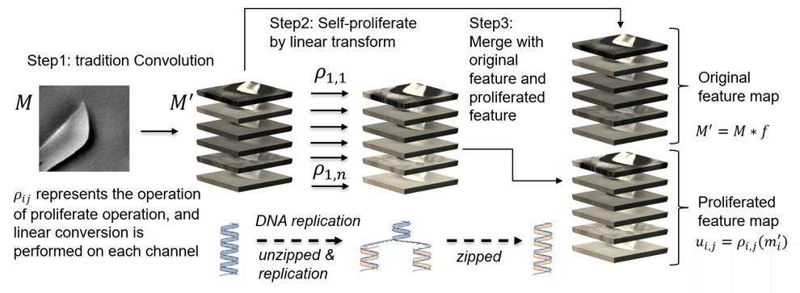
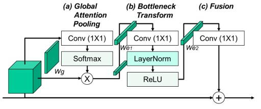
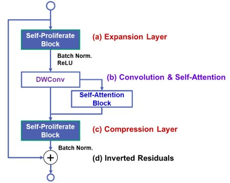
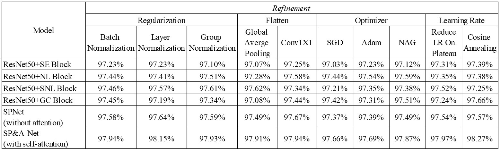
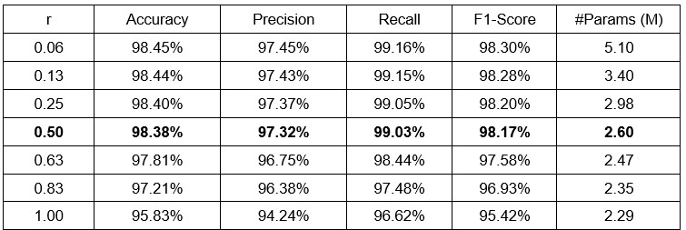
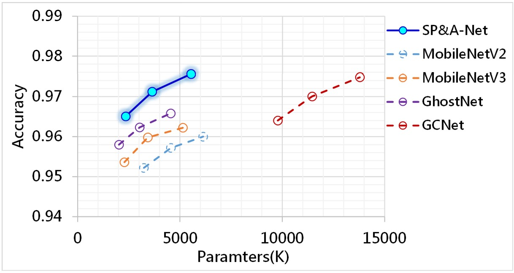
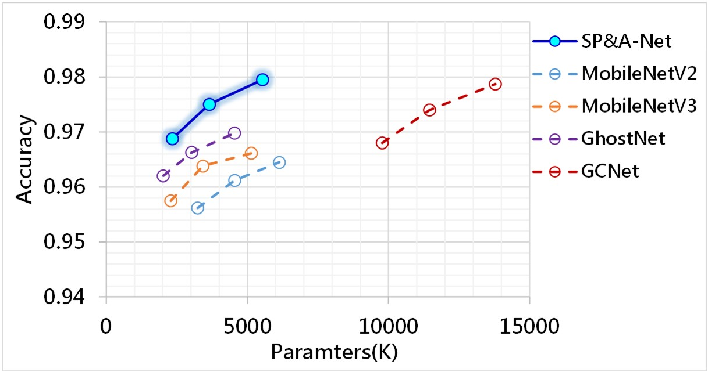
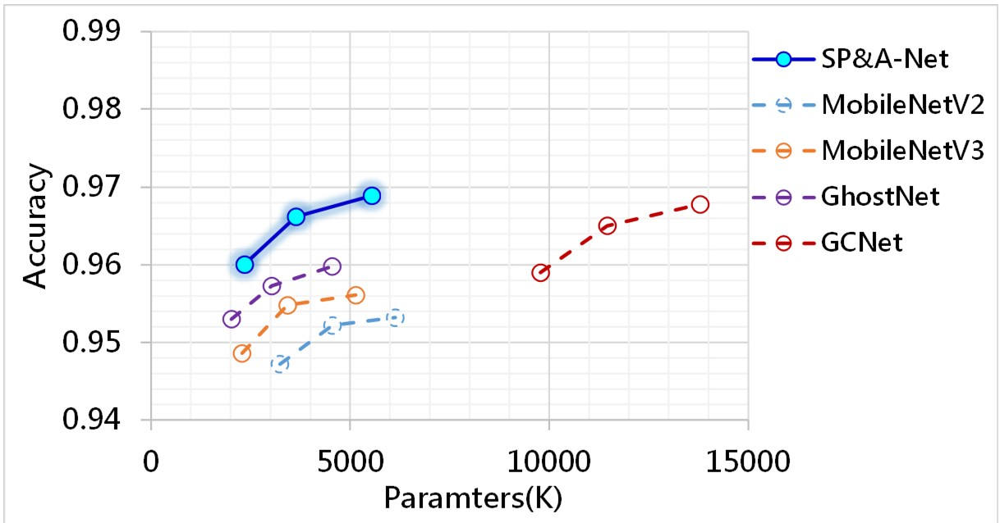

## SP&A-Net
### Official tensorflow implementation of the paper: "Semiconductor Defect Pattern Classification by Self-Proliferation-and-Attention Neural Network [SP&A-Net](https://ieeexplore.ieee.org/document/9628175?source=authoralert)"

## SP&A-Net's Architecture.
* The first function of SP&A-Net is the self-proliferation, using a series of linear transformations to generate more feature maps at a cheaper cost. We can train image classifier in a more efficient way. Plz refer to ```Self_Proliferate.py```


* The second function is self-attention, capturing the long-range dependencies of the feature map using the channel-wise and spatial attention mechanism. Plz refer to ```Self_Attention.py```


* SP&A Block
Plz refer to ```Self_Proliferate_and_Attention.py```



## Code

### Install dependencies

```
python -m pip install -r requirements.txt
```

This code was tested with python 3.7  

###  Train
This script is based on CIFAR-10 as an example. For training, please run:

```
python TestRun.py
```

## Script Introduction

```Self_Proliferate.py``` is used to generate more feature maps (As paper section 3.A).

```Self_Attention.py``` is used to capturing the long-range dependencies of the feature map (As paper secton 3.B).

```Self_Proliferate_and_Attention.py``` follow the spirit of MobileNet,  "capture features in high dimensions and transfer information in low dimensions",  to make the network more efficient. (As paper secton 3.C).

```SPA_Net.py``` is the overall network architecture of SP&A-Net. Please refer section 3.D of this paper.

```CircleLoss.py``` is used to estimate the loss rate during model training with two elemental deep feature learning approaches: class-level labels and pair-wise labels (as section 3-E).

```SP&A-Net-Test-Run.ipynb``` is in the form of a Jupyter Notebook as a simple display with CIFAR-10 as the training object.

## Ablation Study
Below Table shows the ablation study of the SP&A-Net compared with the ResNet-50 in different blocks.  GC block performs slightly better than SE, NL and SNL blocks. SP&A-Net performs better than ResNet-50 with GC blocks. According to the ablation study results, we choose Layer Normalization as the regularization strategy, Conv1X1 as the flattening method, Nesterov Accelerated Gradient as the optimizer strategy, and finally Cosine Annealing as the learning rate function.



Below Table presents the accuracy, precision, recall, F1-score, and model parameters in 7 composition ratio (r) of self-proliferating in defect pattern classification. We do experiments under the same number of SP&A layers (16 layers). In order to prevent the classifier from not detecting defective wafers (false negative), the internal rule is that the recall rate should be greater than 99%. Therefore, we exclude parameter settings with r greater than 0.5. In addition, the accuracy of r = 0.06 / 0.13 / 0.25 is slightly higher than the accuracy of r = 0.05. However, the number of parameters used in its model has increased significantly., so we take r=0.5 as the best parameter setting.


## Result
### AEI Dataset:



### ADI Dataset:



### API Dataset:



<iframe frameborder="0" class="juxtapose" width="100%" height="466.4755700325733" src="https://cdn.knightlab.com/libs/juxtapose/latest/embed/index.html?uid=f1892be4-5da0-11ed-b5bd-6595d9b17862"></iframe>
